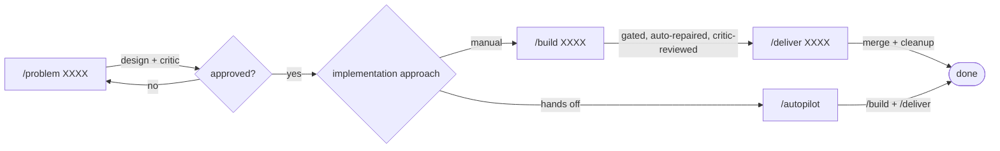

# harness-combined quickstart

**Setup:** `/init` (once per project — edit `.tickets/_standards.md` after)

**Feature work:**

```
/problem XXXX   → design + critic → approval
/build XXXX     → implement, gated, auto-repaired, critic-reviewed
/deliver XXXX   → merge + cleanup
```

**Quick one-off (no ticket):**
```
/build "description"   → /deliver <run-id>
```

**Hands-off mode:** after `/problem` approves a ticket, `/autopilot-watch start` picks it up and runs `/build` → `/deliver` automatically. Check with `/autopilot-watch status`, stop with `/autopilot-watch stop`.

**Everyday checks:**
- `/status` — what's open
- `/gate XXXX` — manual lint/type/test/security run
- `/review XXXX` or `/critique <files>` — deeper code review

Gates (lint, types, tests, security) run automatically on every write and turn — no separate step needed.
