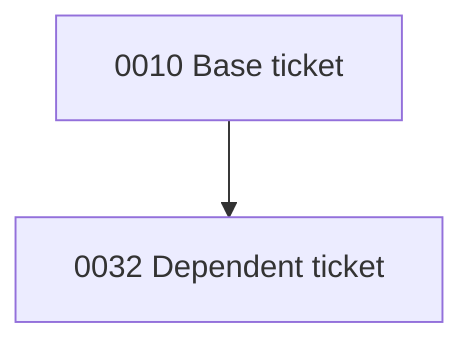

Generate a concise ticket status summary from the `.tickets/` directory.

## Step 1 — Read all status files

```bash
for f in .tickets/*/status.md; do echo "=== $f ==="; cat "$f"; done
for f in .tickets/completed/*/status.md; do echo "=== $f ==="; cat "$f"; done
```

Separate tickets by location and status:
- **Active tickets**: any ticket under `.tickets/` (not `completed/`) — these are open regardless of status value.
- **Completed tickets**: any ticket under `.tickets/completed/` — these are archived (status `done` or `cancelled`).

Collect each active ticket's number, title, status string, and `owner` field. Read these from the ticket's **worktree** copy when it exists locally — `.worktrees/<slug>/.tickets/<slug>/status.md` — because post-claim states (`solution`, `implementing`, `review-ready`, `changes-requested`) are **branch-only**; `main`'s copy is just the `claimed` stub. Fall back to `main`'s stub when the worktree is absent.

> **Cross-machine limitation:** without the ticket's worktree locally, only `main`'s `claimed` stub is visible, so the ticket reads as `claimed` even when its pushed branch is further along. Accepted; inspect the branch directly (`git show ticket/<slug>:.tickets/<slug>/status.md`) if needed.

## Step 2 — Read problem.md for open tickets

```bash
for f in .tickets/*/problem.md; do echo "=== $f ==="; cat "$f"; done
```

From each open ticket's `problem.md`, extract:
- Any `## Dependencies` section listing other ticket numbers
- Scope signals: tickets touching migrations + multiple handlers + middleware are **large**; tickets adding a filter or extending one endpoint are **small**

## Step 3 — Output

Produce output in this exact structure — no preamble, no closing remarks:

### Open Tickets

| Ticket | Title | Status | Owner |
|---|---|---|---|
| NNNN | Title | `status` | owner |

*(sorted ascending by ticket number)*

### Completed Tickets

| Ticket | Title | Status |
|---|---|---|
| NNNN | Title | `done` / `cancelled` |

*(sorted ascending by ticket number; omit section if no completed tickets)*

### Implementation Order

**Wave N — [short wave label]**
N. **NNNN** — one-line reason (size signal + dep note if relevant)

**Critical path:** `NNNN → NNNN → NNNN` — one sentence naming the bottleneck ticket.

### Dependency Graph

Build the dependency graph from every open and completed ticket's `depends-on:` field by
delegating to `ticket_deps.py` — do **not** re-implement graph logic in prose:

```python
from pathlib import Path
from ticket_deps import parse_deps, mermaid_diagram, topo_layers

graph = parse_deps(Path(".tickets"))            # scans .tickets/ and .tickets/completed/
diagram = mermaid_diagram(graph)                # Mermaid `graph TD`, labels sanitized
waves = topo_layers(graph)                      # execution-order waves
```

Render a fenced ` ```mermaid ` block containing the `graph TD` output so GitHub renders it:

````

````

Then render the **execution-order waves** from `topo_layers` in the same wave format as the
Implementation Order section above (one wave per topological layer). If no ticket declares a
`depends-on:` field, state: *No declared dependencies — all tickets are independent.*

## Ordering rules

1. **Status stage first** — `implementing` > `review-ready` > `requirements` > `solution` > `problem` > `open`. Tickets already in motion go first.
2. **Unblock others early** — if ticket A is a dependency of tickets B and C, A moves up.
3. **Small before large** — when two tickets have equal priority, the smaller one goes first.
4. **Wave labels** should be short and descriptive (e.g., "finish active work", "small unblocked extensions", "audit foundation", "capstone / depends on all above").

## Critical path

The longest dependency chain: `A → B → C` where each ticket is a dependency of the next. Follow with one sentence naming the end goal. If all tickets are independent, say: **Critical path:** none — all open tickets are independent.
